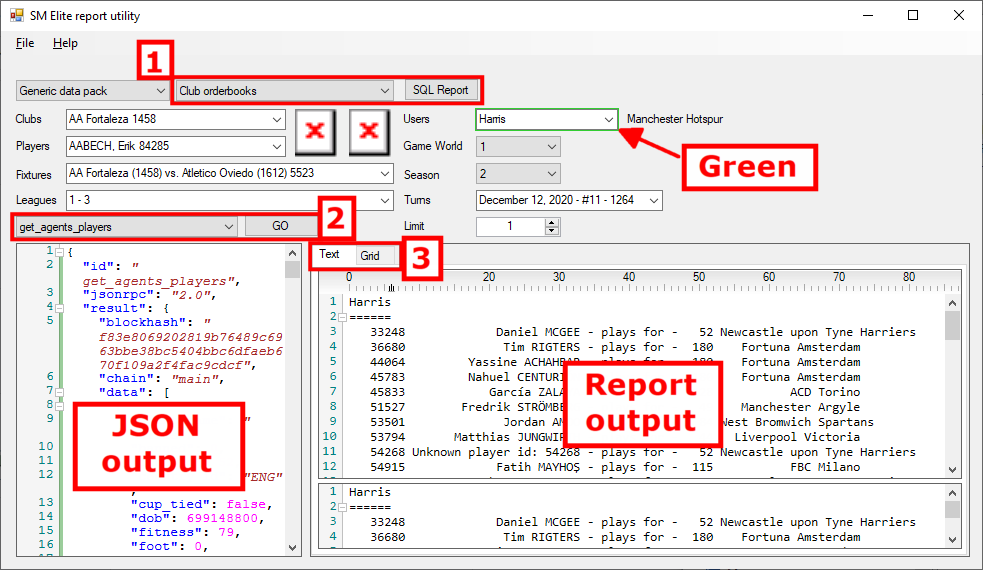

# Soccer Manager Elite Utility

The Soccer Manager Elite Utility software for SM Elite creates reports with some analysis.

# Requirements

This utility requires:

- Windows OS
- SM Elite running
- Xaya Electron wallet or Xaya QT wallet running

It will not work with the SM Elite Simple Mode. You must use Advanced Mode with a full node wallet as above.

For the SQL reports, they should work in Simple Mode, but this is NOT tested. 

# Notes

There are a couple things you should be aware of.

1. This is alpha software
1. For programmers, the code quality isn't great, but it works
1. This uses the SM Elite "No Pack" option

## Alpha Software

This is alpha software. While many reports are working, many are not. This is a work in progress that I've worked on in spare time over a long period.

It was originally simply to provide a few simple reports for SM Elite users and for informational purposes when tracking down bugs. It was never intended for distribution, but it continued to grow. It is incomplete, so know that before using it. If something doesn't work, then it's probaly not implemented yet.

## Code Quality 

Work is done on the UI thread, so the application stops responding until work is done. Yes, it's terrible, but it was always just a quick hack and never intended for distribution.

Further, the planning and architecture for it is non-existent. At different times there were different requirements, and different techniques were used (or abused as the case may be). Namespaces are a mess. The architecture is a mess. It could use a serious refactoring of a good many things. 

So, if you're looking for great software... write your own. 

That being said, the various styles used in there are an **EXCELLENT** tutorial for anyone looking to getting into writing 3rd party software for a true blockchain game in the Bitcoin tradition, i.e. JSON-RPC, and in the Xaya tradition, JSON-RPC plus SQLite.

I would never release software like this commercially. It started as a hack, and remains so. But it works. I'm releasing it because despite its flaws, I think it can be very useful to some people.

## No Pack 

This uses the "No Pack" option in SM Elite. If you want to use another pack, you'll need to create your own. If anyone wants to create another, I can add in functionality to select a custom pack.

# HOW TO USE THE SOFTWARE

First, understand that some features aren't implemented but they're visible in the front end. So, if something doesn't work, try something else.

It's pretty easy to use. There are only a few things to know.

1. The SQL reports
1. The JSON-RPC reports
1. The Text vs Grid option
1. GREEN
1. JSON output
1. Report output

## SQL Reports

In the SQL report dropdown menu, choose the report you want. There are currently 4 financial reports.

Click the SQL report button then wait for it to finish. Check the results using the Text and Grid options.

These are highly customised reports. The Grid option lets you sort and filter to get even more succinct information. You can also export the Grid to a CSV file that you can open in a spreadsheet program such as Microsoft Excel.

## JSON-RPC Reports

These are the bread & butter of a Xaya game. They're used by the SM Elite front end (GUI) to communicate with the SM Elite daemon (smcd.exe).

Not all are implemented. Most are not. The most useful ones are implemented first. Others will follow.

To run a report:

1. Choose the report that you want from the dropdown menu
1. Check for any GREEN highlighted inputs
1. Use the inputs to choose your parameters for the report
1. Click the GO button
1. It will appear in the Text when it's finished

In the screenshot above, you can see that get_agents_players is selected and the Users input is also set. The results show the players for which the user is the agent.

## Text vs. Grid

Initially reports were all text in order to paste them into Discord. The TextBox controls were swapped out for the Fast Colored Text Box controls there now. 

The Grid was added much later in order to facilitate sorting and filtering as well as exporting to a CSV file for use in a spreadsheet program. 

Not all reports have both, so make certain to check them both for any report you run. 

## GREEN

When running a JSON-RPC report, some of them require input parameters. If there are any, the dropdown menus above are highlighted in GREEN. You must set those parameters for useful reports.

## JSON Output

The JSON output is the raw data returned by the SM Elite daemon. It's mostly human readable, but not very friendly. If you have programming skills, you can use this quite easily though. 

It is there because I use it regularly for tracking down bugs from bug reports, and it has proved very useful. 

Regular users will never need to look at it other than perhaps for curiosity's sake. 

## Report Output

This is what you're interested in. You can gain many insights into SM Elite that are NOT available in the game. 

It has a text and a grid tab as described above.

# Xaya Status

This is NOT an official Xaya release. It it not part of the Xaya project. 

# Bugs

Don't even bother reporting bugs to me. I already know about them. I'll fix them when I have time. This includes code bugs. For example, there's a bug with the season_id that doesn't affect anything at all, but could in the future. I'm well aware of the issues.

# Feature Requests

I'm 100% open to feature requests. Hit me up in Discord. 

# Download

There are 2 downloads available. 

1. Code
2. Release

This is fully open source and licensed under the MIT license because I was too lazy to make it WTFPL. 

If you need to ask how to download the code, it won't help you, so don't ask.

But, the RELEASE is what you want if you're a normal human being. For that, check the right-hand side navigation and look for "Releases". Click there and you'll find the release that you can download on that page.

# Running the Utility

1. Download the utility ZIP file as described above.
1. Extract the ZIP file to a folder
1. Run the "SoccerManagerEliteUtility.exe" file

It may take a moment to load. Just be patient.

# Motivations for Release

While I'm terribly embarassed at the code quality and UI responsiveness, it's still functional and very useful.

My logic for releasing it is roughly like this:

1. It's something that I need and find useful
1. Other people could find it useful as well
1. While it's embarassing, I don't really care that much of people chuck shit at me for it
1. It illustrates just how easy it is to create 3rd party software for a Xaya game
1. Meh... so why not?

I think my primary motivation is about showing just how easy it is to get into the Xaya ecosystem. It's dirt simple. Just look at the crappy utility I've hacked up here. Anyone with modest programming skills can get into the Xaya ecosystem very simply. It's not hard. 

I was a believer in Human Mining way back when Huntercoin came out. I think that I'm the most ardent supporter of it on the Xaya team even. I probably wouldn't have joined Xaya if I didn't believe in it. 

So, yeah... my motivations here are to push this insanely beautiful technology forward, and hopefully help to take it mainstream. 

Also, I hope that some people find it useful. ;) 

Peace, love, and eternal grooviness!

